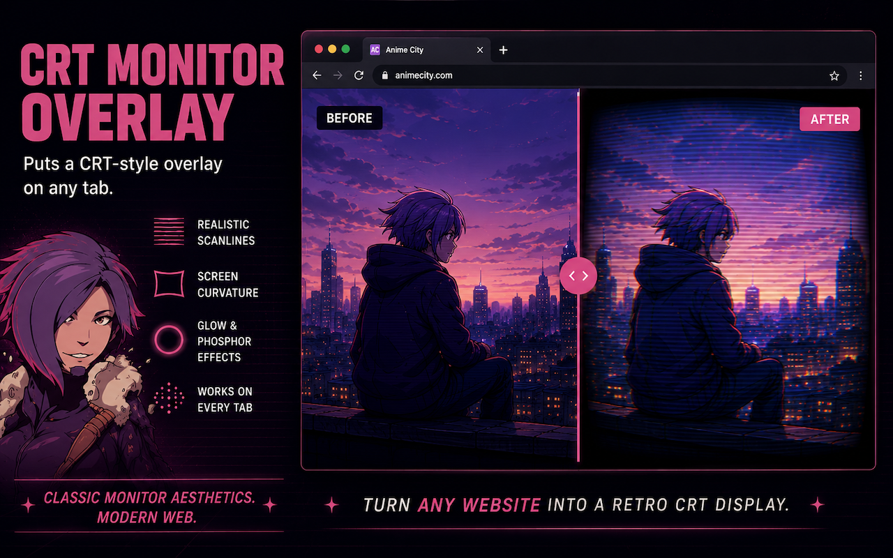
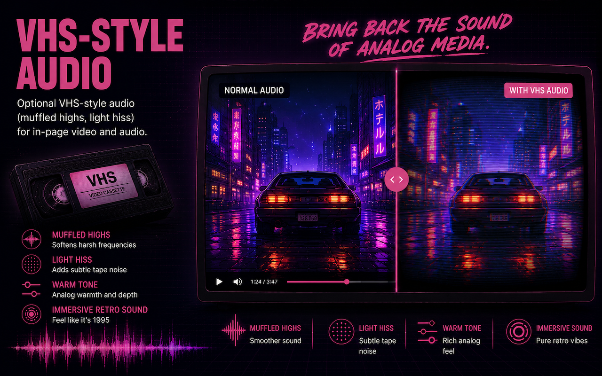

<p align="center">
  
</p>

# CRT Monitor Overlay

Chrome extension that turns any tab into a glowing CRT / VHS display — scanlines, curvature, phosphor bloom, film grain, glitch, and optional lo-fi audio. The overlay is visual only; clicks and keyboard still go to the page.

**Shortcut:** `Ctrl+Shift+C` (Windows/Linux) or `⌘+Shift+C` (Mac) toggles the overlay.

<p align="center">
  
</p>

## Screenshots

<p align="center">
  
</p>

<p align="center">
  
</p>

## Features

- **CRT look** — scanlines, screen curvature, vignette, phosphor glow, flicker, interlace
- **VHS glitch** — RGB split, tracking lines, head-switching bars, noise, dropouts, wobble
- **Image controls** — saturation, contrast, sharpness, hue
- **VHS audio** — muffled highs, tape hiss, warmth, flutter on same-origin `<audio>` / `<video>` (embedded players like YouTube are not affected)
- **Presets** — built-ins plus save / export / import your own
- **Side panel** — tweak every slider without leaving the page

## Install (local)

```bash
npm install
npm run build
```

1. Open `chrome://extensions`
2. Enable **Developer mode**
3. **Load unpacked** → select the `dist` folder

Requires Chrome 114+ (side panel API).

## Chrome Web Store

```bash
npm run package
```

Creates `crt-overlay-chrome-extension-<version>.zip` for upload. See [`docs/PUBLISHING.md`](docs/PUBLISHING.md) and [`docs/STORE_DESCRIPTION.md`](docs/STORE_DESCRIPTION.md).

## Development

```bash
npm run dev
```

Reload the extension in Chrome when sources change.

## Using it

1. Click the toolbar icon to open the side panel
2. Turn **Enable overlay** on and adjust the sliders
3. Save presets for quick recall — settings sync locally across tabs
4. New tabs inherit the overlay if it’s already enabled

## Code note

`src/shared/chrome-facade.js` wraps storage and tab messaging so you can mock it for tests. Prefer the facade over calling `chrome.*` directly in popup / background / content.
